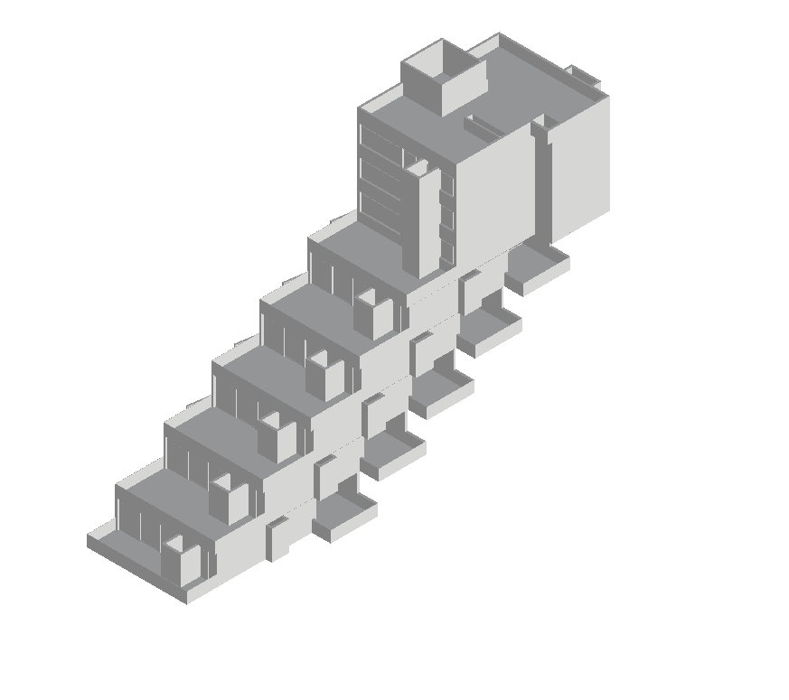
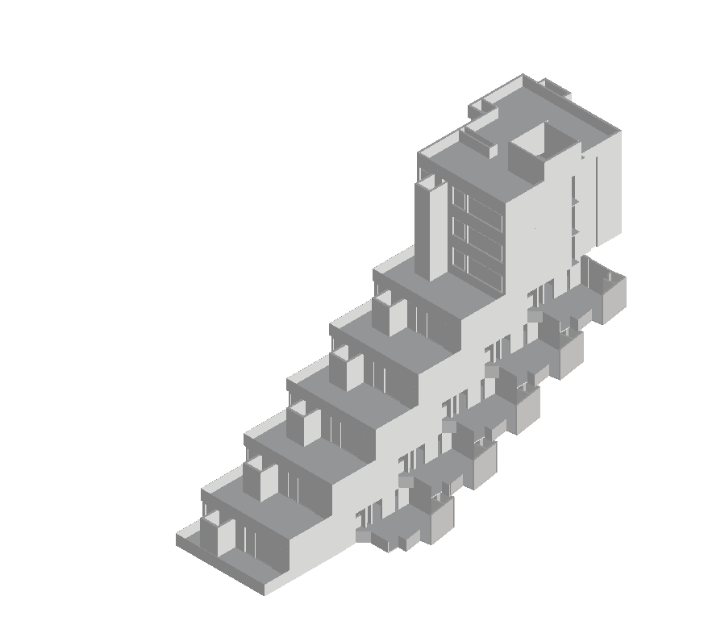
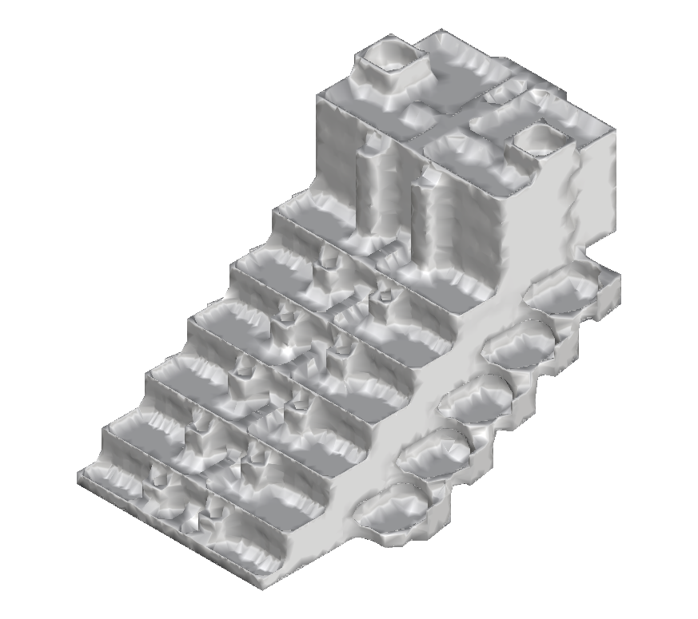

# ShrinkWrap  

This utility generates a watertight and orientable mesh over input 3D geometries 
via the [CGAL library](https://doc.cgal.org/latest/Alpha_wrap_3/index.html). 
This mesh is termed a "shrink wrap".  

A shrink wrap of one storey of an apartment building:  

| Input | Output |
| - | - |
|  |  |

A shrink wrap from multiple inputs:  

| Input 1 | Input 2 | Output |
| - | - | - |
|  |  |  |

### Input  

One or more polygon soups in one of the following file formats:  

* `.off`  
* `.obj`  
* `.stl`  
* `.ply`  
* `.ts`  
* `.vtp`  

### Output  

A shrink wrap in a file format corresponding to the input  

## Installation  

### Conda Linux  

1. Create a conda environment with the necessary preqrequisites via the 
`environment.yml` file:  

    ```bash
    conda env create -f environment.yml
    conda activate shrink-wrap
    ```

2. Build and compile the program:  

    ```bash
    cmake -S . -B ./build-linux
    make -C ./build-linux
    ```

3. Run the program:  

    ```bash
    # Standard usage
    ./build-linux/shrink_wrap 0.5 0.1 -i ./data/Ifc4_SampleHouse.obj

    # Multiple inputs
    ./build-linux/shrink_wrap 500 1 -i ./data/pandan_valley.obj -i pandan_valley.obj

    # Simplify shrink wrap
    ./build-linux/shrink_wrap 500 1 -i ./data/Ifc4_SampleHouse.obj -s 0.5

    # Remesh shrink wrap
    ./build-linux/shrink_wrap 500 1 -i ./data/pandan_valley.obj -r0.1

    # Simplify and remesh (not recommended)
    ./build-linux/shrink_wrap 0.5 0.1 -i ./data/Ifc4_SampleHouse.obj -s 0.5 -p pp -r0.05 -o wonky_house.obj
    ```

## Arguments  

| Name       | Flags | Type          | Description                                                                                                                                                                                                                                 | Option Required | Argument Required | Default         |
|------------|-------|---------------|---------------------------------------------------------------------------------------------------------------------------------------------------------------------------------------------------------------------------------------------|-----------------|-------------------|-----------------|
| `alpha`    | -     | `double`      | Alpha parameter (see [CGAL 3D Alpha Wrapping](https://doc.cgal.org/latest/Alpha_wrap_3/index.html)), must be greater than 0                                                                                                                 | -               | -                 | -               |
| `offset`   | -     | `double`      | Offset parameter (see [CGAL 3D Alpha Wrapping](https://doc.cgal.org/latest/Alpha_wrap_3/index.html)), must be greater than 0                                                                                                                | -               | -                 | -               |
| `input`    | `-i`  | `std::string` | Input filename; use one flag per input file                                                                                                                                                                                                 | `true`          | `true`            | -               |
| `relative` | -     | `bool`        | If used, the alpha and offset used are the maximum diagonal length of the orthogonal box bounding the input divided by `alpha` and `offset` respectively                                                                                    | `false`         | `true`            | `false`         |
| `simplify` | `-s`  | `double`      | If `0.0 < simplify <= 1.0`, the shrink wrap is simplified until the ratio of the number of edges in the simplified mesh to the number of edges in the shrink wrap is equal to `simplify`                                                    | `false`         | `true`            | `-1.0`          |
| `policy`   | `-p`  | `std::string` | If one of `"cp"`, `"ct"`, `"pp"`, or `"pt"`, uses a Garland-Heckbert "Classic Plane", Garland-Heckbert triangle-based, Trettner and Kobbelt "Probabilistic Plane", or Trettner and Kobbelt "Probabilistic Triangle" simplification strategy | `false`         | `true`            | `"cp"`          |
| `remesh`   | `-r`  | `double`      | If used, the shrink wrap or simplified shrink wrap is remeshed such that edge-connected faces within an angle of `remesh` of each other are redrawn onto the same plane                                                                     | `false`         | `false`           | `0.0`           |
| `out`      | `-o`  | `std::string` | Output filename; if not provided this is derived from the first input filename and other parameters                                                                                                                                         | `false`         | `true`            | See description |


Note that simplifying and/or remeshing the shrink wrap will no longer guarantee 
a watertight or orientable output.
